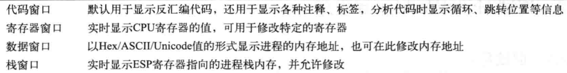
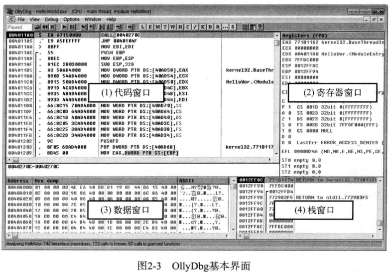
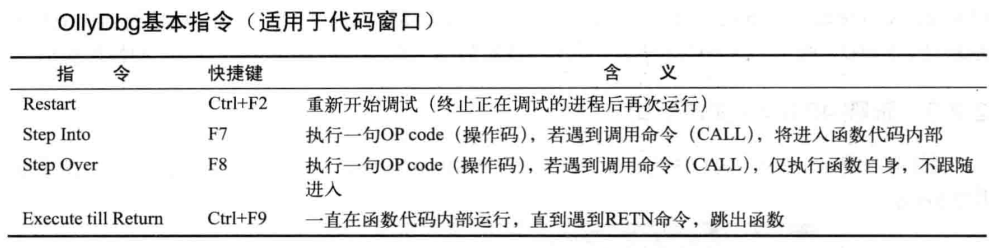
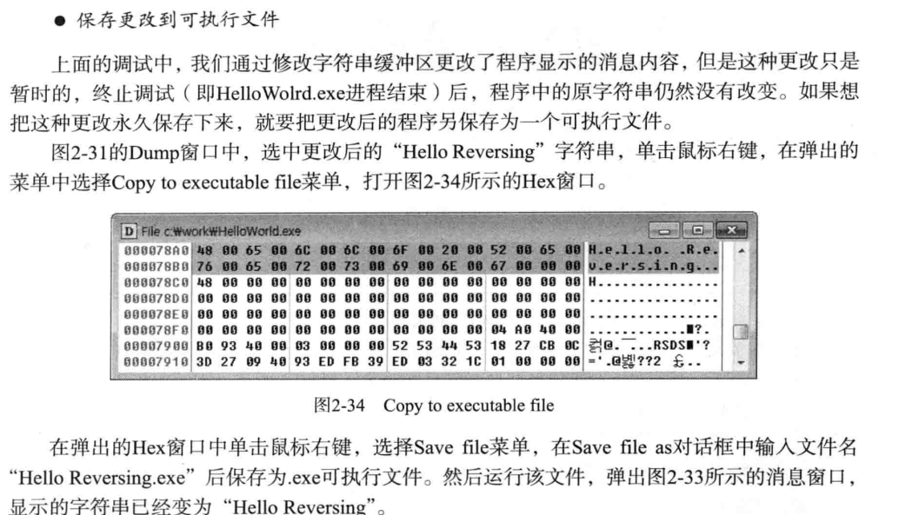
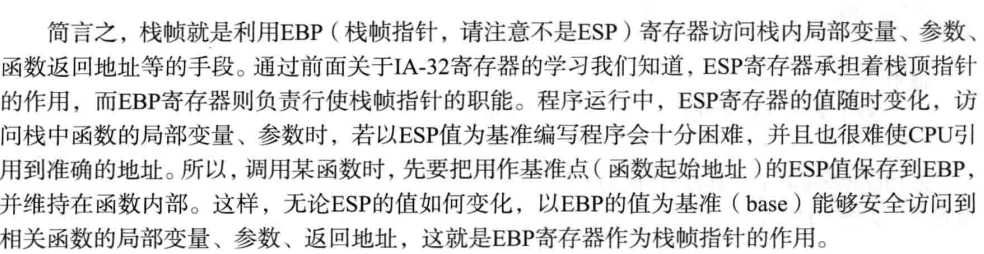

# 5.19-5.24
ollyDbg的使用

《论如何保存可执行文件》（又忘了版）

栈帧

PyInstaller逆向
[thread-2033673-1-1.html](https://www.52pojie.cn/thread-2033673-1-1.html)

一些常用的API

访问原数据
idc.get_wide_byte(ea) // 获取单字节，按整形解释
idc.get_wide_word(ea) // 获取双字节，按整形解释
idc.get_wide_dword(ea) // 获取四字节，按整形解释
idc.get_qword(ea) // 获取八字节，按整形解释
idc.GetFloat(ea) //获取四字节，按浮点解释
idc.GetDouble(ea)//获取八字节，按浮点解释
idc.get_bytes(ea,size) // 在ea获取size字节，按byte解释
给数据打补丁
patch_byte(ea, value)//给ea的一个字节，设置值为value
patch_word(ea, value) //给ea的2个字节，设置值为value
patch_dword(ea, value) //给ea的4个字节，设置值为value
patch_qword(ea, value) //给ea的8个字节，设置值为value
获取地址的反汇编
idc.GetDisasm(ea)//获取ea的汇编指令 比如 mov     rbp, rsp
idc.print_insn_mnem(ea)//获取ea的汇编指令的名字，比如mov
idc.print_operand(ea,n)//对立即数的获取，比如rbp，rsp
链接：idapython使用笔记 | wonderkun's | blog

winrar漏洞
[17715977.html](https://www.cnblogs.com/GoodFish-/p/17715977.html)
[s?__biz=MjM5NTc2MDYxMw==&mid=2458544969&idx=1&sn=473822d99738dc8c20cf0c7df866adea&poc_token=HFyXMWijd3cHiFN_sKM0IUS4MMCY3YNlizGngCmW](https://mp.weixin.qq.com/s?__biz=MjM5NTc2MDYxMw==&mid=2458544969&idx=1&sn=473822d99738dc8c20cf0c7df866adea&poc_token=HFyXMWijd3cHiFN_sKM0IUS4MMCY3YNlizGngCmW)

rust
因为 Rust 语言的特性，很难找到具体功能的实现逻辑在哪，调用链有点复杂，实际的加密逻辑与主逻辑包了非常多层，所以采用动调

qemu四种远程调试方法
[9662](https://xz.aliyun.com/news/9662)

就这些了
下周放假的时候争取多弄些》……《